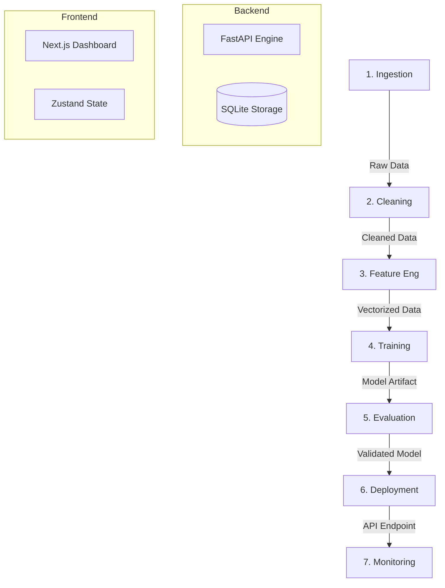

# DS-FORGE: The Data Science Operating System


<div align="center">
  
  <p><em>Fig 1: DS-Forge Control Center</em></p>
</div>

DS-Forge is a premium, self-contained **Data Science Operating System** that unifies the entire Machine Learning lifecycle into a single, cohesive interface. It allows users to perform end-to-end analytics—from raw data ingestion to production deployment—without writing a single line of boilerplate code.

Designed for privacy and performance, the entire pipeline runs locally on your CPU using optimized Docker containers, ensuring zero-cost compute and complete data sovereignty.

## Table of Contents

- [Features](#features)
- [Pipeline Architecture](#pipeline-architecture)
- [Tech Stack](#tech-stack)
- [Getting Started](#getting-started)
  - [Prerequisites](#prerequisites)
  - [Installation](#installation)
- [Usage Guide](#usage-guide)
  - [1. Data Ingestion](#1-data-ingestion)
  - [2. Cleaning Engine](#2-cleaning-engine)
  - [3. Feature Engineering](#3-feature-engineering)
  - [4. Model Training](#4-model-training)
  - [5. Evaluation & AI Analytics](#5-evaluation--ai-analytics)
  - [6. Deployment](#6-deployment)
  - [7. Monitoring](#7-monitoring)
- [Roadmap](#roadmap)
- [License](#license)

## Features

### 🚀 Entire Pipeline Orchestration
- **Self-Contained OS**: A complete environment that supersedes disparate tools (Jupyter, Excel, MLOps platforms).
- **Glassmorphic UI**: A premium, responsive interface tailored for deep work and visualization.
- **CPU-First Design**: Optimized algorithms (Scikit-learn, XGBoost) specifically tuned to run efficiently on standard CPUs without requiring GPUs.

### 🧠 AI Analyst Integration
- **Qualitative Insights**: Uses LLMs (OpenAI, Groq, Gemini) to analyze training runs and provide "Good/Bad/Overfitting" verdicts.
- **Stateless Privacy**: API keys are stored locally in your browser. The backend acts as a blind proxy, ensuring your credentials and data privacy.

### 🛡️ Robust System Management
- **Factory Reset**: A "Danger Zone" feature to purge the entire database and storage for a clean start.
- **Auto-Persist**: All datasets, models, and artifacts are automatically saved to local Docker volumes.

## Pipeline Architecture

DS-Forge divides the Data Science lifecycle into seven distinct, interconnected stages:



## Tech Stack

| Component | Technology | Description |
|-----------|------------|-------------|
| **Frontend** | Next.js 16 | React framework with Server Actions |
| **Styling** | Tailwind CSS | Utility-first styling with Glassmorphism effects |
| **State** | Zustand | Global state management with local persistence |
| **Backend** | FastAPI | High-performance Python 3.10 REST API |
| **ML Engine** | Scikit-Learn | CPU-optimized classical machine learning |
| **Advanced ML** | XGBoost | Gradient boosting framework |
| **Database** | SQLite | Serverless, file-based relational database |
| **Container** | Docker | Full isolation and reproducibility |

## Getting Started

### Prerequisites

- **Docker Desktop**: The only system requirement.
- **2GB RAM**: Minimum allocation for the containers.

### Installation

#### 1. Clone the Repository
```bash
git clone https://github.com/OmShah74/DS_Forge.git
cd ds-forge
```

#### 2. Launch the OS
Run the orchestration command to build the containers:
```bash
docker-compose up --build
```
*Note: The first build involves compiling the Python environment and may take a few moments.*

#### 3. Access the System
- **Dashboard**: [http://localhost:3000](http://localhost:3000)
- **API Documentation**: [http://localhost:8000/docs](http://localhost:8000/docs)

## Usage Guide

### 1. Data Ingestion
*Objective: Load and standardize raw input.*
- **File Support**: Drag and drop `.csv`, `.json`, or `.xlsx` files.
- **Raw Input**: Paste raw text data directly into the parser.
- **Validation**: System automatically creates a standardized schema and saves the dataset to the `storage/datasets` volume.

### 2. Cleaning Engine
*Objective: Sanitize and preprocess data.*
- **Control Console**: Access 25+ atomic cleaning operations.
    - *Missing Values*: Impute (Mean, Median, Mode) or Drop.
    - *Outliers*: Detect and clamp/remove.
    - *Columns*: Rename, Drop, or Retype.
- **Stream Visualization**: See real-time "Before/After" snapshots of your data as you apply operations.
- **Download**: Export the cleaned dataset at any stage.

### 3. Feature Engineering
*Objective: Transform data for Machine Learning.*
- **Encoding**: Automatically detects categorical columns and applies Label/One-Hot encoding.
- **Scaling**: Normalize (MinMax) or Standardize (Z-Score) numerical features.
- **Preparation**: Splits data into Training and Validation sets ensuring no leakage.

### 4. Model Training
*Objective: Generate predictive artifacts.*
- **Model Zoo**: Select from a curated library of algorithms:
    - *Regression*: Linear Regression, Random Forest, SVR, Gradient Boosting.
    - *Classification*: Logistic Regression, SVM, Decision Trees, AdaBoost.
- **Hyperparameters**: Fine-tune Learning Rate, Estimators, and Depth with built-in formula references.
- **Execution**: Runs entirely on the CPU, utilizing multi-core processing for speed.

### 5. Evaluation & AI Analytics
*Objective: Validate and audit performance.*
- **Metrics Grid**: Precision, Recall, F1-Score, ROC-AUC, MAE, MSE, RMSE.
- **Visuals**: Radar Charts for metric balance and Residual Plots for error distribution.
- **AI Analyst**: Click "Generate Report" to send metrics to an LLM (GPT-4/Llama-3). It reads the results and generates a qualitative report suggesting specific improvements (e.g., "High variance detected, try increasing regularization").

### 6. Deployment
*Objective: Expose model as a service.*
- **One-Click Deploy**: Move a successfully trained model to the `production` slot.
- **REST API**: Auto-generates a `/predict` endpoint for the model.
- **Auto-Encoding**: The inference engine remembers the encodings from Step 3, allowing you to send raw string data (e.g., "Red", "Large") which it automatically converts to numbers for the model.

### 7. Monitoring
*Objective: Track real-world usage.*
- **Live Inference Tester**: A built-in JSON playground to test the API in real-time.
- **Health Checks**: System monitors API latency and error rates.
- *(Version 2 Feature)*: Advanced Grafana dashboards and drift detection are planned for the next release.

## Roadmap

**Version 2.0 (Agentic Era)** will introduce:
- **Agflow Integration**: Orchestrate complex AI agents using visual nodes.
- **Auto-Cleaning Agent**: LLM that plans and executes the entire cleaning pipeline automatically.
- **RAG for Recommendations**: Vector-based search to recommend the best model for your specific dataset.
- **Advanced Monitoring**: LangSmith/Grafana integration for full observability.

## License

This project is licensed under the MIT License - see the [LICENSE](LICENSE) file for details.

---

**Built with ❤️ by Om Shah**
*Data Science Mega Project - Production Edition*
